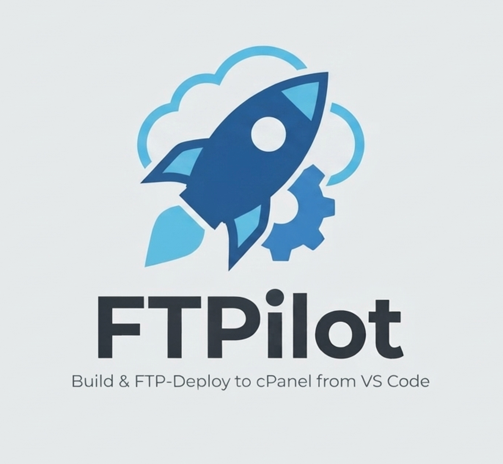

# FTPilot



VS Code extension: build your project and FTP-deploy it to a cPanel server (or multiple domains/subdomains) with one click, from a dedicated `deploy` git branch.

## What it does

1. You work on a `deploy` branch (name configurable).
2. Click **Deploy** in the status bar (or run `FTPilot: Deploy / Redeploy`).
3. FTPilot runs each target's build command, diffs the output against the last deploy, and uploads only what changed over FTP — to as many domains/subdomains as you've configured (e.g. frontend on `app.example.com`, backend API on `api.example.com`).
4. If a target is a cPanel "Setup Node.js App" (Passenger) backend, it touches `tmp/restart.txt` after upload to restart it.

## Setup

1. Open your project folder in VS Code with this extension installed.
2. Run **FTPilot: Configure Project** from the Command Palette.
3. Answer the prompts: deploy branch name, FTP host/port/protocol, default FTP credentials, upload mode (incremental or full), then add one target per domain/subdomain (local build folder → remote folder, build command, optional Passenger restart file, optional separate FTP login for that subdomain).
4. This writes `.ftbdeploy/config.json` (safe to commit — no secrets in it) and opens it for review/editing.

Credentials are stored in VS Code's encrypted SecretStorage, never written to disk in the repo.

## Commands

- `FTPilot: Configure Project` — run the setup wizard
- `FTPilot: Deploy / Redeploy` — build + upload (also the status bar button)
- `FTPilot: Force Full Re-upload` — ignore the manifest, re-upload everything for every target
- `FTPilot: Set FTP Credentials` — set/update credentials for the default account or a per-target override account
- `FTPilot: Edit Config File` — open `.ftbdeploy/config.json`

## Config reference (`.ftbdeploy/config.json`)

```jsonc
{
  "deployBranch": "deploy",
  "warnIfNotOnBranch": true,
  "host": "ftp.yourdomain.com",
  "port": 21,
  "secure": false,           // true = FTPS (explicit TLS)
  "uploadMode": "incremental", // or "full"
  "targets": [
    {
      "name": "Frontend (app.example.com)",
      "buildCommand": "npm run build",
      "cwd": "client",
      "localDir": "client/build",
      "remoteDir": "/app.example.com"
    },
    {
      "name": "Backend (api.example.com)",
      "buildCommand": "npm run build",
      "cwd": "server",
      "localDir": "server/dist",
      "remoteDir": "/api.example.com",
      "restartFile": "/api.example.com/tmp/restart.txt",
      "ftpUser": "api-subdomain-ftp-user"
    }
  ]
}
```

`ftpUser` is optional — set it only when that subdomain has its own separate FTP login. Set its password via `FTPilot: Set FTP Credentials` using that same username as the account name.

## Safety notes

- Incremental mode only ever deletes remote files that FTPilot itself uploaded in a previous deploy (tracked in `.ftbdeploy/manifest.json`, which is gitignored). It never wipes or clears a remote directory, so other projects/subdomains on the same cPanel account are never touched.
- Full mode overwrites files but also never deletes anything remote automatically.

## Development

```bash
npm install
npm run compile   # or: npm run watch
```

Press F5 in VS Code to launch an Extension Development Host and test commands there.

## Status

Early scaffold — built for a MERN + TypeScript project deployed to Apache/cPanel over plain FTP. Not yet published to the Marketplace; install locally via `npm run package` (produces a `.vsix`) then "Install from VSIX" in VS Code, or just run it via F5 during development.
